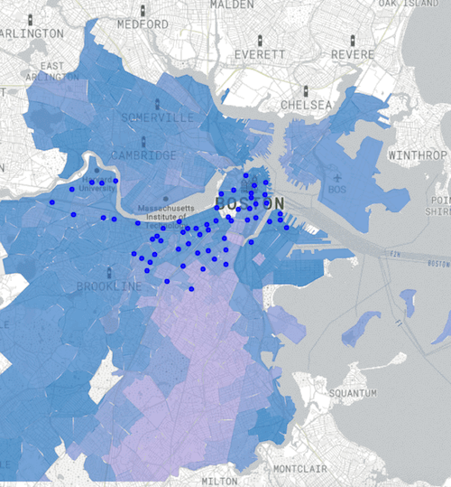
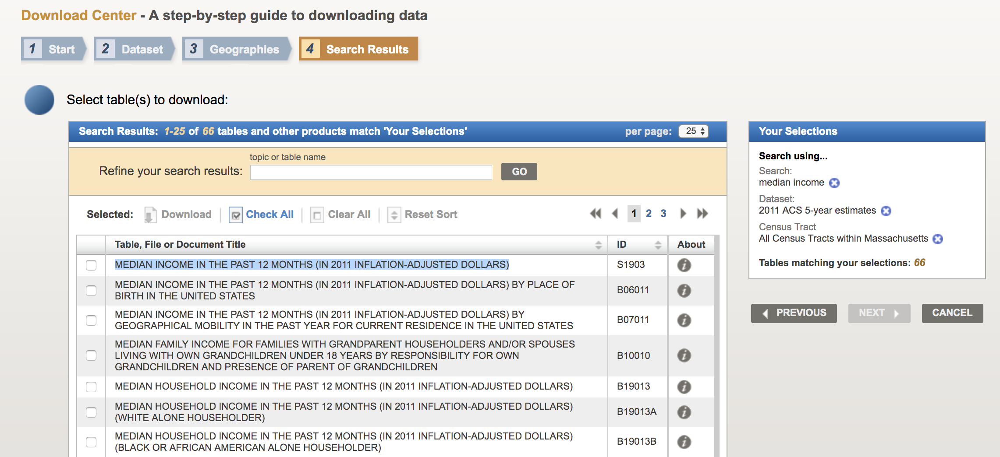

# Income, Race, Bikes

https://aberke.github.io/income-race-bikes/

### Is the placement of bikeshare docks equitable?

The map explores this question visually.

It displays the progressive placement of bikeshare docking stations over time, along with the race and median income of residents in the areas they serve.

The map shows the addition of the docks, as well as the changes in income and race throughout the years the bikeshare program has been in service.  You can toggle the display to see only income, or race, or bikes data, or any of their combinations.

#### Contributions

Contributions are welcome and encouraged, whether they are for the UI, or city data!  If you would like to update city data, or add a city to the map, the process is described below.  Submit a pull request or email me if you have questions.

### Running Visualization Locally

- `npm install`
- `npm start`
- Go to your locally running server at http://127.0.0.1:8080

## Data

### Census Data

Income and race data is provided for each year by census tract.  It is from the [American Community Survey (5-year)](https://www.census.gov/programs-surveys/acs/guidance/estimates.html), which provides yearly population estimates.

The data used for this map is household median income, and household race.
*Race is displayed on the map as “Percent White”, which is calculated as the percentage of households that report “white only” in a given census tract.

As of August 2019, this race and income data is [only available up to 2017](https://www.census.gov/programs-surveys/acs/news/data-releases/2018/release.html), so the map shows the same 2017 data for years 2018 and 2019.
Margins of error are not shown on the map, but are available with all of the processed data here.

#### Obtaining and processing the Census Data

The processing is divided into two parts:
1. Processing/Creating a shapefile to visualize the census tracts
2. Obtaining and processing income/race data for each state's census tracts

The shapefile is then joined with the income/race census data.
The 2010 census tracts are used (redrawn every 10 years)

This is done for each area shown on the map.

For shapefile:
- Get shapefile for census tracts
- Possibly prune the shapefile to only include census tracts
- Process the shapefile to have geoids at census tract granularity
	- To better understand geoids, see https://www.census.gov/programs-surveys/geography/guidance/geo-identifiers.html
	- For processing, see /scripts
This shapefile is (inner-) joined with the given state's census data

For state census data:
- Download the data by going to https://factfinder.census.gov/faces/nav/jsf/pages/download_center.xhtml (OMG this site has some *wild* 90's era graphics)
	- Choose "I know the dataset or table(s) that I want to download."
	- Select "American Community Survey"
	- And then for __each year__ of interest download data for 5-year estimates (e.g. "2014 ACS 5-year estimates")
		- years of interest: beginning of bike sharing program to most recent
	- Select a geographic type: "Census Tract - 140"
		- be careful not to select "Census Tract (or part) - 080"
	- Select state --> Select all Census Tract within [state] --> Add to selection --> Next
	- Select tables (can use search) and download CSVs for tables 1 by 1 (tedious)
		- race as "RACE" (ID:B02001)
		- median income as "MEDIAN INCOME IN THE PAST 12 MONTHS (IN <year> INFLATION-ADJUSTED DOLLARS)" (ID:S1903)
		- 
	- Download each table and open zipfile.  The name of the relevant csv within looks something like "ACS_[yr]_5YR_B02001_with_ann.csv"(race) or "ACS_[yr]_5YR_S1903_with_ann.csv"(income) but double check the file
	- Rename the relevant CSV as "[state]\_[yr]\_[income|race].csv" and save it in the /data/[state]/ directory
		- e.g. 2011 income data for MA from ACS 5-year estimates is saved to "/data/ma/ma_2011_income.csv"

- Process all of the csv data files for the state into one file by running /scripts/census_data_processing (with jupyter)

### Bike Station Data

Bike trips data is scraped (see /scripts).
- NYC: https://s3.amazonaws.com/tripdata/index.html
- Boston: https://s3.amazonaws.com/hubway-data/index.html

This data is used to find the first trip originating from each bike dock station, which is assumed to be when that station was added to the network.

- Run the scraping scripts (/scripts/boston_bikes_data_scraper etc) to download the data locally.
- The data is then processed by the bikes data processing script.
- The output is saved to both csv and json.  That json is then copied to /viz to be used in map.

### Viz notes

Can use URL parameter `?ha` to hide the about section and have the map take up the full height of the frame.  This is useful when embedding in an iframe.
